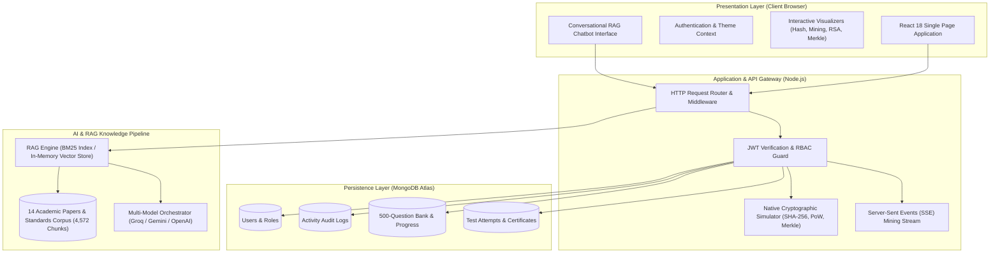
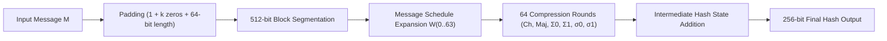
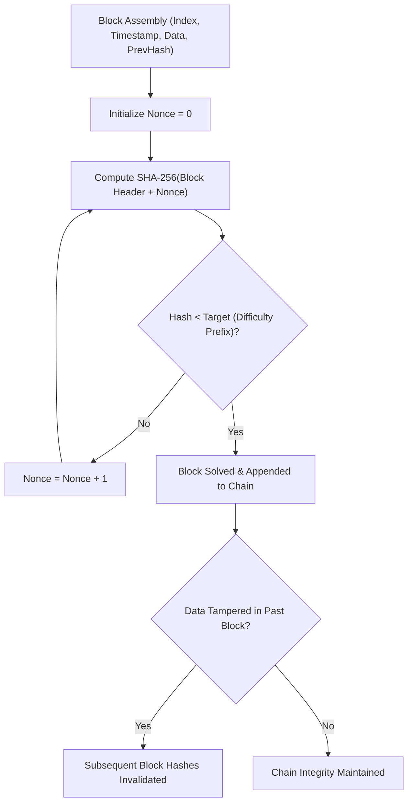
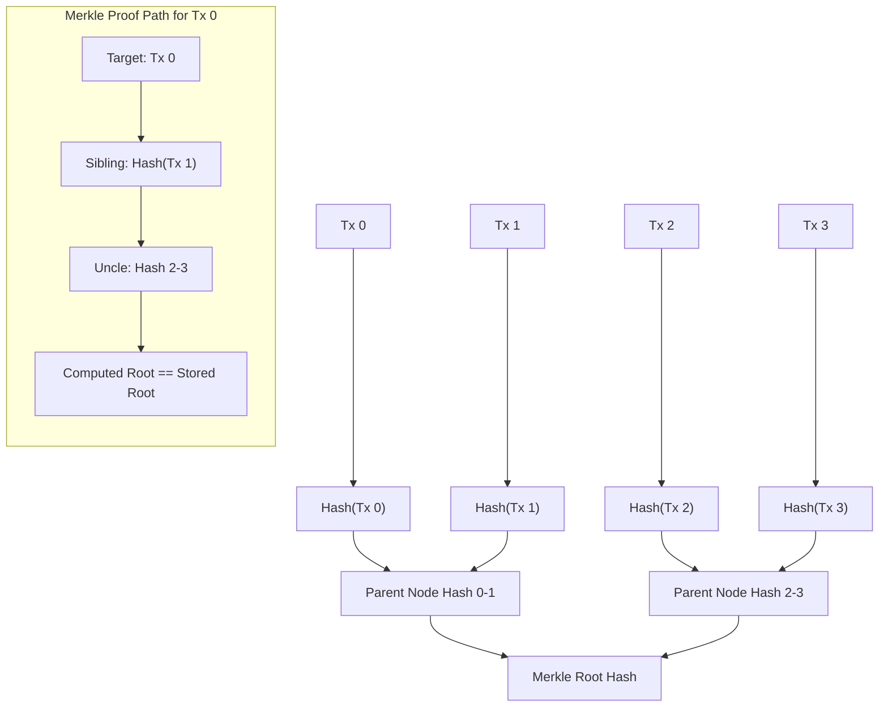
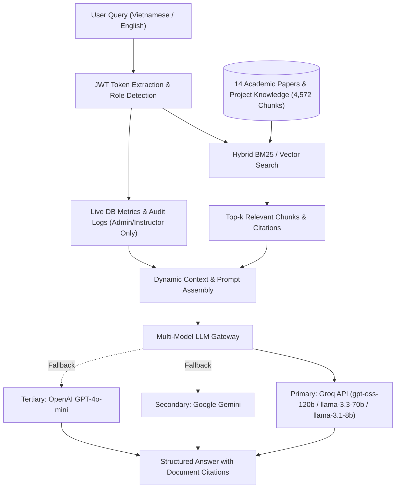

# HubBlock: Interactive Cryptographic Simulation and Blockchain Education Platform

HubBlock is a full-stack educational and scientific platform engineered to visualize cryptographic algorithms, distributed consensus mechanisms, and blockchain architectures. The system provides real-time mathematical simulations of SHA-256 hashing, RSA asymmetric cryptography, Merkle Tree structures, and Proof-of-Work (PoW) mining, coupled with an evaluation and certification engine and a Retrieval-Augmented Generation (RAG) AI assistant.

The project was conducted under the **Student Scientific Research Competition (SVNCKH 2025)** at Ho Chi Minh City University of Banking (HUB).

- **Production Deployment:** [hubblock.onrender.com](https://hubblock.onrender.com)
- **Primary Domain:** Blockchain Architecture, Applied Cryptography, Distributed Systems, Interactive Pedagogy

---

## Table of Contents

1. [Executive Overview](#executive-overview)
2. [System Architecture](#system-architecture)
3. [Core Technical Modules](#core-technical-modules)
   - [SHA-256 Cryptographic Engine](#sha-256-cryptographic-engine)
   - [Proof-of-Work Consensus and Chain Integrity](#proof-of-work-consensus-and-chain-integrity)
   - [RSA Asymmetric Cryptography and Digital Signatures](#rsa-asymmetric-cryptography-and-digital-signatures)
   - [Merkle Tree and Cryptographic Verification Paths](#merkle-tree-and-cryptographic-verification-paths)
   - [Examination, Assessment, and Certification System](#examination-assessment-and-certification-system)
   - [Role-Based Access Control and System Administration](#role-based-access-control-and-system-administration)
   - [Retrieval-Augmented Generation (RAG) AI Assistant](#retrieval-augmented-generation-rag-ai-assistant)
4. [Technology Stack](#technology-stack)
5. [Directory Structure](#directory-structure)
6. [API Specification](#api-specification)
7. [Environment and Configuration](#environment-and-configuration)
8. [Installation and Execution](#installation-and-execution)
9. [Research Team and Academic Supervision](#research-team-and-academic-supervision)
10. [License](#license)

---

## Executive Overview

Understanding blockchain technology requires comprehending foundational cryptographic primitives, decentralized state synchronization, and adversarial threat models. Traditional pedagogical methodologies often rely on abstract mathematical formulas or static code samples, presenting a significant barrier for students and researchers.

HubBlock bridges this theoretical gap by offering dynamic, step-by-step visual computations directly in the browser, validated against a deterministic Node.js backend and a reference Java core implementation. The platform is designed with bilingual support (Vietnamese and English) and dual visual themes (dark and light mode).

```
+-------------------------------------------------------------------------------+
|                               HUBBLOCK ECOSYSTEM                              |
+-------------------------------------------------------------------------------+
| [Client Tier]           React 18 + Vite + TailwindCSS + HTML5 Canvas          |
| [Server Tier]           Pure Node.js HTTP/REST APIs + Server-Sent Events (SSE)|
| [Storage Tier]          MongoDB Atlas (Users, Audits, Exams, Question Bank)   |
| [Cryptographic Engine]  SHA-256 Rounds, RSA Keygen, Merkle Tree Root & Proofs |
| [AI Engine]             Groq / Gemini / OpenAI + BM25 Vector RAG (14 Papers)  |
| [RBAC & Audit]          Role-Based Access (Admin / Instructor / Student)      |
+-------------------------------------------------------------------------------+
```

---

## System Architecture

The system follows a decoupled layered architecture comprising presentation, application gateway, cryptographic execution cores, database persistence, and an intelligent knowledge retrieval pipeline.



---

## Core Technical Modules

### SHA-256 Cryptographic Engine

The SHA-256 engine demonstrates the deterministic property, fixed-length digest generation (256 bits / 64 hexadecimal characters), and the avalanche effect as standardized in FIPS PUB 180-4.



- **Step-by-Step Round Inspection:** Inspects message expansion, addition modulo $2^{32}$, and logical bitwise functions across all 64 rounds.
- **Avalanche Effect Visualizer:** Quantifies bit variation between two marginally altered inputs (e.g., flipping a single bit), illustrating an average output bit variation of approximately 50%.

---

### Proof-of-Work Consensus and Chain Integrity

The mining module illustrates the Hashcash Proof-of-Work mechanism popularized by Bitcoin. Users can explore block proposal, nonce discovery, difficulty adjustment, and cascading chain invalidation upon data modification.



- **Adjustable Difficulty:** Configurable difficulty levels (1 to 5 leading hexadecimal zeros). Each level scales target search complexity by a factor of 16.
- **Real-Time Mining Stream:** Server-Sent Events (SSE) provide live telemetry of hashing rates, candidate nonces, and elapsed computation time.
- **Dynamic Invalidation Lab:** Mutating data within an arbitrary block recalculates its hash, breaking the cryptographic link ($H_{prev} \neq H_{actual}$) for all subsequent blocks until re-mined.

---

### RSA Asymmetric Cryptography and Digital Signatures

This module exposes the mathematical mechanics of public-key cryptography and digital signatures based on the integer factorization problem.

- **Key Generation:** Select prime numbers $p$ and $q$, compute modulus $n = p \cdot q$ and Euler's totient $\phi(n) = (p - 1)(q - 1)$. Derive public exponent $e$ such that $\gcd(e, \phi(n)) = 1$, and calculate private exponent $d \equiv e^{-1} \pmod{\phi(n)}$ using the Extended Euclidean Algorithm.
- **Encryption and Decryption:** Modular exponentiation demonstrations:
  $$c \equiv m^e \pmod{n}, \quad m \equiv c^d \pmod{n}$$
- **Digital Signatures:** Message signing ($s \equiv H(m)^d \pmod{n}$) and signature verification ($v \equiv s^e \pmod{n} = H(m)$), confirming authenticity and non-repudiation.

---

### Merkle Tree and Cryptographic Verification Paths

The Merkle Tree module implements binary cryptographic trees used in distributed ledgers for efficient and secure verification of large data sets (SPV nodes).



- **Interactive Binary Reduction:** Constructs a complete Merkle Tree from arbitrary transaction lists, handling odd node duplication per cryptographic standard.
- **Merkle Proof Verification Path:** Highlights the logarithmic verification path $O(\log_2 N)$, proving inclusion without requiring the complete ledger transaction history.
- **Real-Time Root Recalculation:** Modifying a transaction dynamically propagates changes up the branch to update the root hash.

---

### Examination, Assessment, and Certification System

A rigorous evaluation system enables knowledge validation with persistent tracking.

- **Question Bank:** 500 bilingual (Vietnamese/English) questions categorized into 9 domains:
  1. Hash Functions and SHA-256
  2. Mining and Proof-of-Work
  3. RSA Asymmetric Encryption
  4. Merkle Trees
  5. Blockchain Fundamentals
  6. Cryptography Fundamentals
  7. Peer-to-Peer Networks and Nodes
  8. Smart Contracts
  9. Blockchain Security and Threat Models
- **Practice Mode:** Topic-specific training with instant feedback and explanatory rationales.
- **Examination Mode:**
  - 40 randomly sampled questions stratified by difficulty (16 Easy, 16 Medium, 8 Hard).
  - 60-minute countdown timer with automated grading.
  - Passing score: 70% (28/40 correct).
- **Automated Digital Certification:** Successful candidates receive a verified certificate with a cryptographic identifier, exportable to vector PDF via jsPDF and verifiable through a public endpoint (`/api/cert/verify/:code`).

---

### Role-Based Access Control and System Administration

The platform implements Role-Based Access Control (RBAC) with three tiers:

```
[Student]       Practice quizzes, attempt timed exams, view personal profile and earned certificates.
   |
[Instructor]    Full Question Bank CRUD management, review student progress and pass/fail distributions.
   |
[Administrator] Global telemetry, user account administration, role escalation, immutable activity logs.
```

- **Instructor Portal:** Interface for creating, editing, and deleting questions with bilingual validation, and monitoring cohort performance analytics.
- **Administrator Dashboard:** Comprehensive metrics tracking user registration timelines, exam completion rates, certificate counts, and an audit trail tracking security-critical actions (logins, role updates, test submissions).

---

### Retrieval-Augmented Generation (RAG) AI Assistant

The platform integrates an intelligent assistant built on a localized RAG architecture to answer questions about blockchain theory and platform features.



- **Document Corpus:** Indexed from 14 international research publications, whitepapers, and technical specifications, including:
  - *Bitcoin: A Peer-to-Peer Electronic Cash System* (Satoshi Nakamoto)
  - *Ethereum Whitepaper* (Vitalik Buterin)
  - *FIPS PUB 180-4: Secure Hash Standard (SHS)* (NIST)
  - *RFC 3447: Public-Key Cryptography Standards (PKCS) #1: RSA Cryptography Specifications*
  - Comprehensive university reference curricula on distributed ledger technologies.
- **Dynamic System Context:** The assistant is supplied with real-time project metadata, development team records, and academic supervision details. For privileged roles, it can synthesize real-time user metrics and system statistics.

---

## Technology Stack

| Layer | Component | Specification / Library | Purpose |
|---|---|---|---|
| **Frontend UI** | Framework | React 18.2.0 | Reactive component-based interface |
| | Tooling | Vite 5.2.0 | Optimized build pipeline and HMR |
| | Styling | TailwindCSS 3.4.19 + CSS Modules | Visual design system |
| | Visualizations | HTML5 Canvas + Lucide Icons | Real-time rendering of crypto algorithms |
| | Document Export | jsPDF 4.2.1 + html2canvas 1.4.1 | Client-side certificate generation |
| **Backend API** | Runtime | Node.js 18+ (ES6+) | Application gateway and REST server |
| | Architecture | Pure Node.js standard built-ins (`http`, `crypto`, `fs`) | Cryptographic parity with core specifications |
| | Streaming | Server-Sent Events (SSE) | Real-time mining telemetry |
| **Data & Auth** | Persistence | MongoDB Atlas via Mongoose 9.4.1 | Schema modeling and database storage |
| | Authentication | JWT (jsonwebtoken 9.0.3) + bcryptjs 3.0.3 | Token-based session management |
| | SSO | Google Identity Services (GIS) | OAuth2 user authentication |
| **AI & RAG** | Inference API | Groq Cloud SDK / REST API | Ultra-low latency LLM inference |
| | LLM Models | `openai/gpt-oss-120b`, `llama-3.3-70b`, `llama-3.1-8b` | Generative question answering |
| | Secondary LLMs | Google Gemini 1.5 Flash / OpenAI GPT-4o-mini | Failover model orchestration |
| | Orchestration | LangChain.js (`@langchain/core`, `community`, `openai`, `google-genai`, `textsplitters`) | PDFLoader, RecursiveCharacterTextSplitter, PromptTemplate, ChatOpenAI `.withFallbacks()` |
| | RAG Index | LangChain BM25Retriever + VectorStoreRetriever (cosine similarity) | Grounded domain knowledge retrieval |
| **Java Core** | Reference Core | Java 17 (`java.security.*`) | Reference academic implementation |

---

## Directory Structure

```
blockchain_visualization_tool/
├── server.js                     # Primary Node.js HTTP server, API routes, static serving
├── db.js                         # MongoDB Atlas database connection initialization
├── rag_engine.js                 # LangChain retrievers (VectorStoreRetriever with BM25Retriever fallback)
├── llm_chain.js                  # LangChain PromptTemplates + ChatOpenAI fallback chain (Groq/Gemini/OpenAI)
├── rag_ingest.js                 # LangChain ingestion: PDFLoader → text splitter → embeddings
├── rag_index.json                # Pre-built knowledge base index (4,572 chunks)
├── seed_admin.js                 # Default administrative account seeder
├── vite.config.js                # Vite client configuration and reverse-proxy rules
├── package.json                  # Dependencies and npm script definitions
│
├── middleware/
│   └── auth.js                   # JWT token extraction, verification, and RBAC guard
├── models/
│   ├── User.js                   # User account schema, credentials, and assigned role
│   ├── ActivityLog.js            # Audit trail recording security and operational events
│   ├── Question.js               # Bilingual quiz question schema and answer keys
│   ├── QuizProgress.js           # Per-user practice mode tracking records
│   ├── TestAttempt.js            # Examination submissions, timestamps, and scores
│   └── Certificate.js            # Issued credentials with cryptographic verification codes
├── routes/
│   ├── admin.js                  # Administrator telemetry, user roles, and audit endpoints
│   ├── instructor.js             # Question bank CRUD and cohort performance endpoints
│   ├── auth.js                   # User registration, authentication, and profile endpoints
│   └── quiz.js                   # Public question distribution, exam flows, and certification
│
├── src/
│   ├── App.jsx                   # Master application controller and route mapping
│   ├── main.jsx                  # React runtime initialization
│   ├── context/
│   │   └── AuthContext.jsx       # Global authentication state provider
│   ├── data/
│   │   ├── lang.js               # Comprehensive bilingual dictionary (VI / EN)
│   │   ├── team.js               # Development team profiles and research supervisor data
│   │   └── quiz_questions.json   # Base collection of 500 bilingual exam items
│   ├── views/
│   │   ├── HomeView.jsx          # Landing page with interactive cryptographic showcase
│   │   ├── HashDemoView.jsx      # SHA-256 round visualizer and avalanche effect lab
│   │   ├── MiningView.jsx        # PoW mining simulator, explorer, and difficulty scaling
│   │   ├── QuizView.jsx          # Interactive testing, timed examination, and certificate UI
│   │   ├── ProfileView.jsx       # User portfolio, examination history, and issued credentials
│   │   ├── AdminView.jsx         # Administrative dashboard, user management, audit logs
│   │   ├── InstructorView.jsx    # Instructor question bank authoring and analytics
│   │   ├── AboutProjectView.jsx  # Research context, problem statement, and methodology
│   │   ├── AboutTeamView.jsx     # Team biographies, supervisor info, and achievements
│   │   └── rsa/
│   │       ├── RSADemoView.jsx   # RSA encryption, decryption, and signature workspace
│   │       └── components/       # Step-by-step keygen, math breakdown, modular arithmetic
│   ├── components/
│   │   ├── Chatbot.jsx           # RAG AI assistant floating interface with source citations
│   │   ├── LoginModal.jsx        # Credentials authentication and Google OAuth dialog
│   │   ├── BlockchainCanvas.jsx  # Dynamic canvas visualizer for block integrity
│   │   ├── ParticleBackground.jsx# Hardware-accelerated canvas background
│   │   ├── Footer.jsx            # Institutional branding and links
│   │   ├── merkle/               # Tree rendering, proof animation, tamper testing
│   │   └── ui/                   # Reusable atomic UI primitives
│   └── styles/
│       └── global.css            # Base stylesheet and theme tokens
│
├── java-core/                    # Independent Java reference implementation
│   ├── Block.java                # Immutable block record structure
│   ├── Blockchain.java           # Chain validation and state management
│   ├── BlockchainServer.java     # Standalone Java HTTP server
│   ├── ProofOfWork.java          # PoW mining loop
│   └── HashUtil.java             # Cryptographic utility wrappers
└── public/                       # Static media, icons, and institutional emblems
```

---

## API Specification

The server exposes a RESTful API on port `3001` (or the port defined by `PORT`).

### Cryptographic Simulation and Blockchain

| Method | Endpoint | Access | Description |
|---|---|---|---|
| `GET` | `/api/chain` | Public | Retrieves current chain state and block metadata |
| `POST` | `/api/block/add` | Public | Mines and appends a new block |
| `POST` | `/api/block/tamper` | Public | Modifies a block's payload to demonstrate chain invalidation |
| `POST` | `/api/block/restore` | Public | Re-mines the invalid block and re-links subsequent blocks |
| `GET` | `/api/mine/stream` | Public | Server-Sent Events (SSE) stream of real-time mining nonces |
| `POST` | `/api/hash` | Public | Computes the SHA-256 digest of an arbitrary payload |
| `POST` | `/api/hash/steps` | Public | Returns detailed 64-round intermediate computation variables |
| `POST` | `/api/merkle` | Public | Generates a Merkle Tree and root hash from transaction array |
| `POST` | `/api/difficulty` | Public | Updates the active Proof-of-Work difficulty target (1 to 5) |
| `POST` | `/api/reset` | Public | Restores the blockchain to its initial Genesis Block state |
| `GET` | `/api/validate` | Public | Performs cryptographic verification across the full chain |

### Authentication and User Management

| Method | Endpoint | Access | Description |
|---|---|---|---|
| `POST` | `/api/auth/register` | Public | Registers a new account with email, password, and display name |
| `POST` | `/api/auth/login` | Public | Authenticates credentials and returns a signed JWT token |
| `POST` | `/api/auth/google` | Public | Authenticates Google OAuth ID tokens |
| `GET` | `/api/auth/me` | Bearer JWT | Retrieves profile data for the authenticated account |
| `GET` | `/api/config` | Public | Supplies public configuration parameters (Google Client ID) |

### Assessment and Certification

| Method | Endpoint | Access | Description |
|---|---|---|---|
| `GET` | `/api/quiz/questions` | Public | Fetches questions filtered by topic and difficulty |
| `GET` | `/api/quiz/topics` | Public | Aggregates item counts across the 9 subject domains |
| `POST` | `/api/quiz/progress` | Bearer JWT | Records per-item practice answers and learning progress |
| `GET` | `/api/quiz/progress` | Bearer JWT | Retrieves user mastery statistics across topics |
| `POST` | `/api/exam/start` | Bearer JWT | Generates an active 40-question examination session |
| `POST` | `/api/exam/submit` | Bearer JWT | Grades submitted examination answers and evaluates pass status |
| `GET` | `/api/exam/history` | Bearer JWT | Fetches historical examination attempts and scores |
| `GET` | `/api/cert/my` | Bearer JWT | Lists all certificates awarded to the authenticated user |
| `GET` | `/api/cert/verify/:code` | Public | Validates authenticity of an issued certificate by identifier |

### Instructor Management

| Method | Endpoint | Access | Description |
|---|---|---|---|
| `GET` | `/api/instructor/questions` | Instructor / Admin | Lists question items with pagination and domain filters |
| `POST` | `/api/instructor/questions` | Instructor / Admin | Creates a new bilingual question item |
| `PUT` | `/api/instructor/questions/:qid` | Instructor / Admin | Updates an existing question item |
| `DELETE` | `/api/instructor/questions/:qid` | Instructor / Admin | Deletes a question item from the active bank |
| `GET` | `/api/instructor/students` | Instructor / Admin | Returns student cohort progress and assessment analytics |

### System Administration and Auditing

| Method | Endpoint | Access | Description |
|---|---|---|---|
| `GET` | `/api/admin/stats` | Admin | Provides global platform metrics, user cohorts, and pass rates |
| `GET` | `/api/admin/users` | Admin | Returns paginated user accounts with search and role filters |
| `GET` | `/api/admin/users/:id` | Admin | Returns detailed profile, test history, and certificates of a user |
| `PATCH` | `/api/admin/users/:id/role` | Admin | Updates account role (`student`, `instructor`, `admin`) |
| `GET` | `/api/admin/logs` | Admin | Returns paginated audit log entries with action and date filters |

### Intelligent AI Assistant

| Method | Endpoint | Access | Description |
|---|---|---|---|
| `POST` | `/api/chat` | Public / Auth | Submits message to the RAG pipeline with role-aware context |
| `GET` | `/health` | Public | Verifies server operational status and database connectivity |

---

## Environment and Configuration

The application loads environment variables natively from a `.env` file located in the root directory.

```env
# Database Persistence
MONGODB_URI=mongodb+srv://<username>:<password>@<cluster>.mongodb.net/hubblock?retryWrites=true&w=majority

# Security and Cryptography
JWT_SECRET=replace_with_a_secure_random_string_of_sufficient_length

# LLM Providers for RAG Engine (At least one key is required for AI Chatbot)
GROQ_API_KEY=gsk_your_groq_api_key_here
GEMINI_API_KEY=your_gemini_api_key_here
OPENAI_API_KEY=sk-your_openai_api_key_here

# Single Sign-On (Optional)
GOOGLE_CLIENT_ID=your_google_oauth_client_id.apps.googleusercontent.com

# Server Networking
PORT=3001
```

| Parameter | Type | Required | Description |
|---|---|---|---|
| `MONGODB_URI` | String | Yes | MongoDB Atlas connection URI for data persistence |
| `JWT_SECRET` | String | Yes | Secret key used for signing and verifying HMAC-SHA256 JWT tokens |
| `GROQ_API_KEY` | String | Recommended | Groq Cloud API key for low-latency model inference |
| `GEMINI_API_KEY` | String | Optional | Google Gemini API key as a secondary inference provider |
| `OPENAI_API_KEY` | String | Optional | OpenAI API key as a fallback inference provider |
| `GOOGLE_CLIENT_ID` | String | Optional | Google OAuth 2.0 Web Client ID for Google Authentication |
| `PORT` | Number | Optional | Server port (defaults to `3001` if unset) |

---

## Installation and Execution

### Prerequisites

- **Node.js:** Version 18.0.0 or higher
- **npm:** Version 9.0.0 or higher
- **MongoDB Atlas Cluster:** Accessible instance with connection credentials
- **API Key:** Groq Cloud, Google AI Studio, or OpenAI

### Installation

Clone the repository and install project dependencies:

```bash
git clone https://github.com/khiemdztv/blockchain_visualization_tool.git
cd blockchain_visualization_tool
npm install
```

### Development Mode

To start both the Node.js backend server and the Vite development server concurrently:

```bash
npm run dev
```

- Client Application: `http://localhost:5173`
- Backend API Server: `http://localhost:3001`

### Production Build and Execution

Compile the frontend assets into the `dist/` directory:

```bash
npm run build
```

Run the production server, which hosts both the API endpoints and serves static distribution assets:

```bash
npm start
```

---

## Research Team and Academic Supervision

HubBlock was researched, developed, and deployed by **VTK Team**, students of the **Faculty of Data Science in Business** at **Ho Chi Minh City University of Banking (HUB)**.

### Academic Supervisor

- **Dr. Nguyen Hoai Duc (TS. Nguyễn Hoài Đức)**
  - Position: Faculty Supervisor
  - Department: Faculty of Data Science in Business (*Khoa Khoa học Dữ liệu trong Kinh doanh*)
  - Institution: Ho Chi Minh City University of Banking (HUB)
  - Role: Research methodology oversight, cryptographic theory guidance, and technical critique
  - Contact: `ducnh@hub.edu.vn`

### Development Team — VTK Team

| Member | Academic Affiliation | Project Role | Responsibilities |
|---|---|---|---|
| **Lam Tuan Vu**<br>*(Lâm Tuấn Vũ)* | Faculty of Data Science in Business, HUB | Team Lead<br>Backend Developer | Node.js architecture, SHA-256 implementation, blockchain consensus logic, Merkle Tree structures, RESTful APIs, and database integration |
| **Do Gia Khiem**<br>*(Đỗ Gia Khiêm)* | Faculty of Data Science in Business, HUB | Frontend Developer | React user interface, responsive layout design, HTML5 Canvas animation engines, cryptographic simulation visualizers, and state management |
| **Nguyen Vu Thang**<br>*(Nguyễn Vũ Thắng)* | Faculty of Data Science in Business, HUB | Research & Documentation | Cryptographic standards research (FIPS/NIST), 500 bilingual assessment question bank authoring, RAG document corpus compilation, and project documentation |

### Project Achievements

- **Student Scientific Research Project (*SVNCKH 2025*)** — Ho Chi Minh City University of Banking (HUB)
- **Full-Stack Production Deployment** — Successfully implemented and deployed an interactive cryptographic simulation platform integrated with an intelligent RAG AI assistant.

### Contact Information

- **Team Email:** `vtkteam2005@gmail.com`
- **Supervisor Email:** `ducnh@hub.edu.vn`
- **Institutional Address:** Ho Chi Minh City University of Banking, 36 Ton That Dam, District 1, Ho Chi Minh City, Vietnam

---

## License

This project is licensed under the **MIT License**. See the `LICENSE` file for full terms.

```
Copyright (c) 2025 VTK Team — Faculty of Data Science in Business, Ho Chi Minh City University of Banking (HUB)
```
